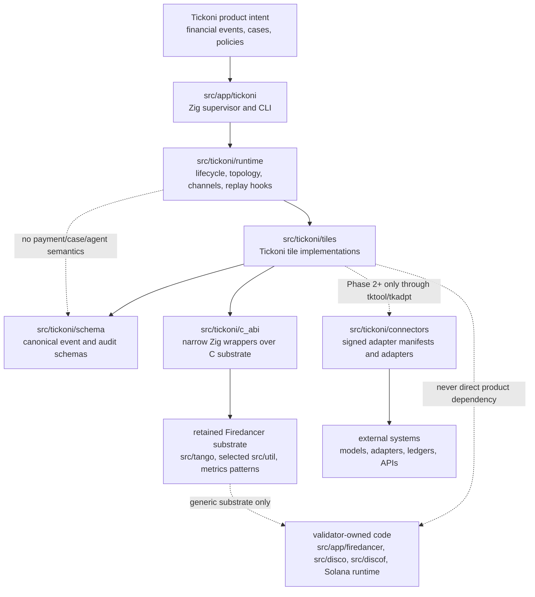
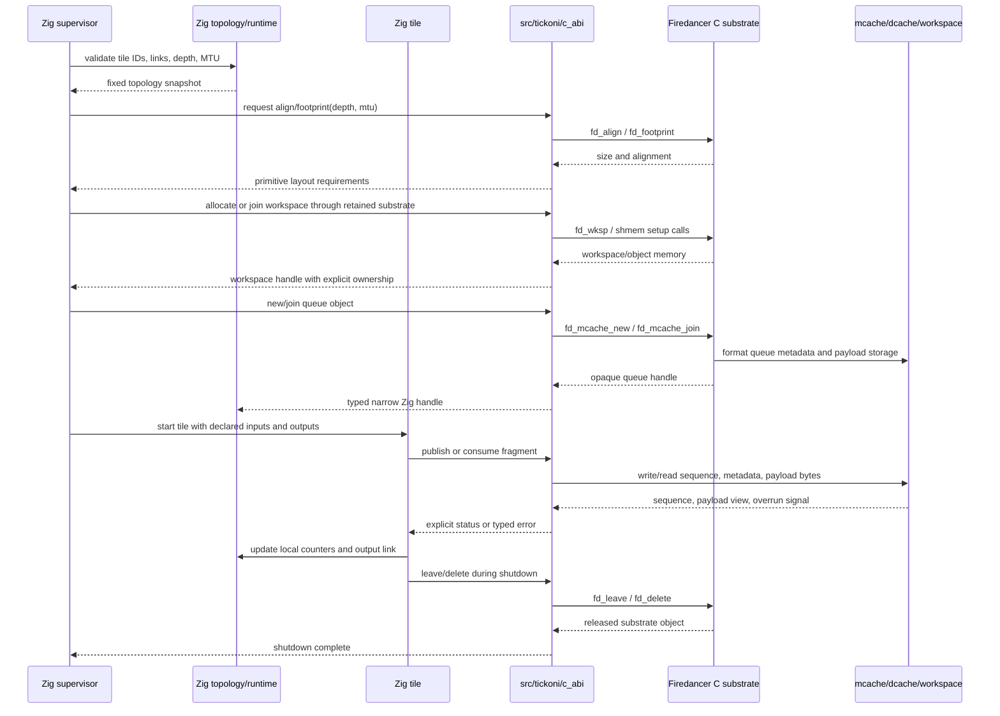

# Tickoni Zig Runtime Philosophy And Style Guide

This document extends [`firedancer.md`](firedancer.md) for the Zig-native
Tickoni runtime. It is not a replacement for the Firedancer philosophy. It is
the rulebook for carrying that philosophy into Tickoni without mixing product
logic into upstream-hot validator code or hiding isolation boundaries behind
comfortable abstractions.

Read "Tickoni" here as:

- `src/app/tickoni`: Zig supervisor, CLI, and process lifecycle entrypoints
- `src/tickoni/runtime`: topology, channels, tile handles, lifecycle, metrics,
  backpressure, and replay/runtime support
- `src/tickoni/c_abi`: narrow Zig declarations and wrappers around retained
  Firedancer C substrate
- `src/tickoni/schema`: Tickoni financial event, policy, audit, case, and
  capability schemas
- `src/tickoni/tiles`: Tickoni-owned tile implementations
- `src/tickoni/connectors`: signed adapter manifests and adapter code, when
  that phase exists

Do not use this guide as permission to edit `src/app/firedancer`,
`src/disco`, `src/discof`, `src/tango`, or `src/util` for Tickoni convenience.
Those paths remain upstream substrate unless a change is genuinely generic and
reviewed as such.

## Core Rule

Tickoni is a financial event runtime first and an AI harness second.

The implementation order is:

```text
runtime first
cases second
agents third
privileged actions last
```

Do not introduce agents, model calls, adapters, UI state, or privileged action
execution into the deterministic event path. A payment event must be ingestible,
normalized, deduplicated, policy-checked, audited, and replayable without
running a model.

## Preserve The Firedancer Shape

Zig may make code safer and clearer, but it must not make the system less
explicit. The Firedancer inheritance worth keeping is:

- explicit topology over discovery
- fixed capacity over unbounded allocation
- one writer for hot mutable state
- bounded channels over unbounded message queues
- process isolation over in-process trust
- concrete restart, overrun, shutdown, and telemetry behavior
- mechanical simplicity in hot loops

The reader should still be able to answer the Firedancer questions for every
Tickoni change:

1. Which tile owns this state?
2. Which workspace or allocation holds it?
3. Which process maps or owns it, and in what mode?
4. Which fields are written concurrently, and by whom?
5. What is the overrun, restart, and shutdown behavior?
6. Which metrics or logs tell an operator it is unhealthy?

If those answers are vague, do not add the code yet.

## Separation Rules

Keep these boundaries hard.

### Separation Diagram

The runtime separation should look like this:



The dotted lines are warning lines. They should trigger design review, not
become convenience paths.

### Validator Substrate vs Product Runtime

Allowed:

- wrap stable Firedancer substrate behind `src/tickoni/c_abi`
- reuse `src/tango` queue concepts, `src/util/sandbox`, metrics patterns, and
  topology/process-lifecycle ideas
- import upstream fixes into retained substrate deliberately

Not allowed:

- add Tickoni fields to Firedancer topology structs for product convenience
- rename Solana validator tiles into financial tiles
- put financial event schemas in `src/disco`, `src/discof`, or `src/flamenco`
- make the Tickoni product binary depend on Solana protocol tiles
- keep whole-tree merge pressure as an excuse to preserve unused validator code

When in doubt, add a narrow wrapper in `src/tickoni/c_abi` or a Tickoni-owned
module, not a product hook in upstream C.

### Zig To C Action Diagram

Zig owns product semantics and tile lifecycle. C owns retained low-level
substrate primitives. The ABI boundary passes primitive configuration, pointers,
footprints, and status. It must not pass Tickoni product structs into Firedancer
substrate.



The important direction is not "Zig above C" or "C below Zig." The important
direction is ownership:

- Zig topology decides which tile may see which object.
- C substrate formats and operates low-level memory objects.
- Product schemas stay in Tickoni-owned Zig modules.
- Opaque C handles stop at the C ABI wrapper or the narrow runtime object that
  owns them.
- Tiles exchange bytes and sequence state through declared links, not through
  hidden global access.

### Runtime vs Product Semantics

`src/tickoni/runtime` owns generic runtime machinery:

- topology descriptors
- tile handles
- lifecycle state
- bounded channel descriptions
- metrics surfaces
- replay/runtime control hooks
- process and sandbox configuration

It must not own payment-specific behavior, case decisions, agent prompts,
adapter manifests, or accounting ledger logic. Those belong in schema, tile, or
connector modules.

### Tiles vs Libraries

A tile is an execution owner. It should have one responsibility and one clear
ownership boundary.

Good tile boundaries:

- `tkings` owns ingestion offsets and ingress backpressure
- `tknorm` owns canonical event normalization
- `tkdedu` owns deduplication state
- `tkpoly` owns policy decisions for its phase
- `tkaudt` owns append-only audit ordering
- `tkrepl` owns deterministic replay comparison
- `tkmetr` owns metrics export
- `tkdiag` owns process and queue diagnostics

Bad boundaries:

- one "processor" tile that ingests, normalizes, dedupes, and audits
- a shared mutable case table updated by several tiles
- a helper library that secretly launches model calls from the event path
- a global registry that lets tiles discover arbitrary channels or objects

Libraries can parse, hash, encode, and validate. Tiles own mutable runtime
state and external authority.

### Agents, Tools, And Privileged Actions

Agents are not the security boundary. Policy, tile isolation, capability
envelopes, and audit are the boundary.

Rules:

- agent workers do not get shell access
- agent workers do not get unrestricted network access
- model-provider network access belongs behind `tkmodl`
- tool access belongs behind `tktool`
- external integrations belong behind signed `tkadpt` instances
- money-adjacent mutation belongs behind `tkexec`
- replay never invokes production mutation

Do not add a convenience path around these boundaries, even for demos. Demos
must prove the boundary, not bypass it.

## Topology Before Code

Before implementing a non-trivial tile or link, update the architecture or tile
plan with:

- runtime ID and human-readable name
- phase
- owned state
- input links
- output links
- queue depth and MTU
- reliable or unreliable behavior
- backing workspace or allocation
- producer and consumer mapping/ownership mode
- restart behavior
- overrun behavior
- shutdown behavior
- metrics

Example:

```text
link: tkdedu_tkpoly
producer: tkdedu
consumer: tkpoly
payload: deduplicated event decision input
depth: 1024
mtu: fixed event envelope size
reliability: reliable
owner writes: tkdedu writes payload and publish sequence
consumer writes: tkpoly writes only local counters and output link
overrun: producer applies backpressure before dropping correctness-bearing input
restart: consumer resumes from audited source offset or replay capsule
metrics: produced, consumed, lag, backpressure_ns, malformed, dropped
```

If the topology cannot be written plainly, the implementation is probably
mixing responsibilities.

## Firedancer Configuration And The Zig Harness

Changes to Firedancer configuration, layout, topology, sandboxing, or
diagnostics affect the Zig harness even when no Tickoni product code changes.
The harness is allowed to wrap Firedancer-derived substrate, but it must not
turn Firedancer's explicit contracts into implicit Zig convenience.

Treat these Firedancer concepts as harness-facing contracts:

- `src/app/firedancer/config/default.toml` documents operator defaults and
  option names.
- `config_t` records parsed and derived values.
- `src/app/firedancer/topology.c` turns configuration into concrete tiles,
  links, workspaces, objects, affinity, memory, and feature gating.
- Tile launch code turns topology into process mappings, sandbox permissions,
  metrics registration, and run-loop entry.

The Tickoni equivalent should preserve the same shape:

- `src/app/tickoni` owns CLI/config loading and supervisor startup.
- `src/tickoni/runtime/topology.zig` owns the immutable topology snapshot.
- `src/app/tickoni/supervisor.zig` owns tile lifecycle and start/stop order.
- `src/tickoni/c_abi` owns narrow wrappers around retained C primitives.
- Tickoni product schemas and agent/case logic stay outside the runtime
  substrate.

When a Firedancer-derived option crosses into Tickoni, map it deliberately:

1. The external name and default are documented in Tickoni-owned config docs or
   profile files.
2. The parsed Zig config type has a bounded field with explicit units.
3. Validation rejects unsupported values before the supervisor starts.
4. The topology snapshot records the resulting tile count, channel depth, MTU,
   workspace/allocation requirement, and feature gate.
5. The supervisor allocates all required handles and backing memory before the
   steady-state path.
6. The C ABI wrapper receives only primitive layout inputs such as depth, MTU,
   alignment, footprint, uid/gid, rlimit, or file descriptor lists.
7. Sandbox, network, filesystem, and model/tool permissions are visible as
   explicit runtime fields, not hidden side effects of an option.
8. Metrics, diagnostics, audit, or startup logs expose the effective behavior.

Do not make Zig "simpler" by collapsing those steps into one builder that
discovers everything at runtime.  A contributor should be able to inspect the
topology snapshot and know what will exist, how large it is, who owns it, and
which process can access it.

### Layout Translation

Firedancer layout is not just CPU placement.  It changes how many isolated
execution owners exist and how links are wired between them.  The Tickoni
harness should treat its own tile counts the same way.

If a Tickoni config adds `tkdedu_tile_count`, for example, the topology must
answer whether events are partitioned by key, round-robin load balanced,
replicated to every dedup tile, or merged by a downstream owner.  The answer
belongs in `Topology`, not in an ad hoc loop inside `Supervisor.start`.

For every configurable tile count, validate:

- enough tile IDs and human-readable names exist,
- every instance gets a stable index and diagnostic identity,
- channel producers and consumers remain one-writer where required,
- channel depths and MTUs are sized for the configured fan-in/fan-out,
- allocation is bounded before the hot path,
- disabled phases remove all dependent channels and permissions,
- monitor and metrics output can distinguish each instance.

### C ABI Drift

If Firedancer changes an `align`, `footprint`, `new`, `join`, `leave`,
`delete`, seccomp, or topology primitive, the Zig wrapper must be reviewed as
part of the same conceptual change.  Do not rely on a stale constant in Zig
when the C header is the authority.

Keep wrapper tests focused on boundary invariants:

- `extern struct` size, alignment, and field offsets,
- constant values copied from C headers,
- error translation for invalid depth, MTU, or footprint,
- lifecycle order around `new/join/leave/delete`,
- restrictive defaults for sandbox config,
- explicit failure when a C primitive returns null or zero footprint.

The C ABI should not accept Tickoni event, case, policy, audit, prompt, or tool
types.  It should accept the primitive substrate facts needed to create or use
memory, queues, sandboxing, and process lifecycle.

### Diagnostics Translation

The operator-visible consequences of configuration must survive the Zig layer.
If a config changes channel depth, tile count, sandbox permissions, replay cap,
model budget, adapter capability, or audit retention, the harness needs an
observable effective value.

Use the right surface:

- startup logs for effective topology, capacities, disabled phases, and
  sandbox facts,
- metrics for lag, drops, overruns, backpressure, crashes, and restart count,
- audit records for material financial decisions, denials, external results,
  and replay-relevant facts,
- monitor/API state for tile lifecycle and queue health.

Do not report a configured value when the effective value is different.  Report
what the supervisor actually built.

## Zig Style For Runtime Code

Use idiomatic Zig where it improves explicitness. Do not build a high-level
framework that hides the same details Firedancer makes visible.

Prefer:

- plain structs with explicit fields
- small error sets on boundary APIs
- comptime constants for fixed capacities and layout constraints
- explicit allocator ownership
- slices that make lifetimes obvious
- `extern struct` only for C ABI layout
- tests for layout, limits, and topology validation

Avoid:

- global mutable registries
- dynamic plugin discovery in the runtime path
- unbounded `ArrayList` growth in hot paths
- hidden allocation inside parse, hash, or enqueue helpers
- background threads spawned from utility functions
- generic "event bus" abstractions
- catch-all `anyopaque` handles outside narrow C ABI edges
- convenience APIs that let a tile access state it does not own

Zig safety features are welcome, but they are not a substitute for topology
discipline. A bounds check does not define ownership. An allocator does not
define capacity. A type does not define process isolation.

## Memory And Allocation

Runtime allocations must be bounded by topology or startup configuration.

Good:

- allocate tile handles once during supervisor initialization
- compute queue footprints from depth and MTU
- allocate replay buffers from a configured cap
- reject a config that exceeds fixed limits

Bad:

- allocate per event in the steady-state path
- grow queues because a consumer fell behind
- store whole model transcripts in hot runtime memory
- hide payload copies inside generic helpers

The Phase 0 synthetic pipeline may use ordinary in-process state to prove
lifecycle, but production paths should move toward explicit queue objects,
workspace-backed state, and process isolation.

## Concurrency

Use one writer per hot object. If a design wants multiple writers, the default
answer is to split the object or add a single owner tile.

Allowed patterns:

- producer writes an output channel and publishes sequence
- consumer reads input and writes only its own counters, fseq/progress, and
  output channel
- supervisor owns tile lifecycle state
- audit tile owns audit ordering

Suspicious patterns:

- two tiles mutate the same map
- a helper updates both policy and audit state
- a model callback writes directly into case state
- an adapter writes into the audit chain

Use atomics only for clearly documented lifecycle flags, counters, or ring
protocol fields. An atomic does not make an ownership model correct by itself.

## Error Handling And Assertions

Use assertions for internal invariants that indicate programmer error. Use
explicit errors for operator-facing validation and malformed input.

Good:

- assert that a synthetic test supervisor is using the expected payment pipeline shape
- return `error.ChannelDepthNotPowerOfTwo` from topology validation
- reject malformed financial events with a counted policy/audit record
- fail startup when configured capacity cannot be allocated

Bad:

- assert on user-provided event data in a long-running tile
- silently drop malformed events without metrics
- catch an error and continue with partial topology
- convert all failures to `error.Unknown`

Every failure mode in the event path should answer whether it is:

- configuration error
- malformed input
- backpressure
- overrun
- sandbox/process crash
- replay divergence
- policy denial

## C ABI Rules

`src/tickoni/c_abi` is a narrow membrane, not a second runtime.

Rules:

- keep declarations close to the C header they mirror
- test layout and alignment for every `extern struct`
- expose small Zig wrappers only when they preserve C ownership semantics
- do not invent new lifetime rules for C-owned memory
- do not pass Tickoni product structs through C substrate APIs
- do not let `anyopaque` escape into product tile code unless there is no
  narrower representation

If a C primitive has `align`, `footprint`, `new`, `join`, `leave`, and
`delete`, mirror that lifecycle in Zig. Do not wrap it as a garbage-collected
object or an unbounded container.

## Schema Rules

Schemas are part of replay. Treat them as compatibility surfaces.

Financial event and audit schemas must:

- have explicit versions
- define which fields affect stable hashes
- separate source facts from runtime facts
- define canonical encoding
- reject unknown required fields
- preserve enough source identity to replay and diagnose

Do not let UI labels, model prompts, or adapter-specific JSON become the
canonical schema. Normalize at the boundary and audit the transformation.

## Audit And Replay Rules

Audit is not logging. Replay is not a best-effort rerun.

Rules:

- every material event gets an audit record
- denials and malformed inputs are recorded
- audit records are append-only and hash-chained
- large payloads are content-addressed
- replay compares deterministic outputs and reports first divergence
- replay substitutes external results and never performs privileged mutation

Do not add features that cannot explain how they appear in audit and replay.

## Metrics And Diagnostics

Every tile should expose enough state to determine whether it is healthy.

Minimum useful counters:

- input fragments/events received
- output fragments/events produced
- malformed inputs
- drops
- queue lag
- backpressure time
- overruns
- restart count
- crash count
- audit records produced, where relevant
- replay divergences, where relevant

Logs are for configuration errors, process lifecycle, and rare corruptions.
Steady-state loss, backpressure, and denials should be metrics and audit data,
not log spam.

## Build And Tooling

All Tickoni developer tooling belongs in `justfile` or Tickoni-specific scripts
called by `justfile`. Do not add Tickoni development targets to upstream
Firedancer makefiles.

Use existing recipe naming conventions:

```text
category-scope-verb-component
```

where component is `tk` for Tickoni Zig code, `fd` for Firedancer C code, and
`all` for composition.

Examples:

- `build-tk`
- `test-unit-tk`
- `quality-format-check-tk`
- `security-sanitize-check-tk`

If a tool does not apply to Tickoni yet, the `-tk` recipe may be a no-op in the
justfile. Do not put skip stubs or fake success logic in implementation scripts.

## Phase Discipline

Do not pull later-phase concepts into earlier-phase runtime code.

Phase 0:

- synthetic payment stream
- `tkings -> tknorm -> tkdedu -> tkpoly -> tkaudt`
- `tkrepl`, `tkmetr`, `tkdiag`
- stable event hashes
- append-only audit
- replay comparison
- bounded flow and visible backpressure

Phase 1:

- real fintech-like ingestion API
- `tkcase`
- `tkevid`
- case history
- replay capsule format

Phase 2:

- `tkdisp`
- `tkagnt`
- `tkmodl`
- `tktool`
- `tkadpt`
- model and tool audit
- inference budgets

Phase 3:

- `tkapi`
- CaseOps board and approval workflow

Phase 4:

- `tkexec`
- privileged accounting ledger actions
- TigerBeetle or other finance database integrations

If a demo needs a later-phase behavior early, implement a narrow stub that
preserves the boundary and emits audit records. Do not collapse phases into one
tile.

## Review Checklist

Before merging Tickoni runtime work, check:

1. Does this preserve the product/runtime/substrate boundary?
2. Does each mutable object have one owner?
3. Are channel depths and payload bounds explicit?
4. Is allocation bounded outside the hot path?
5. Are process, sandbox, and network permissions explicit?
6. If this mirrors or wraps a Firedancer config/topology/C ABI change, did the
   Zig config, topology snapshot, supervisor allocation, wrapper tests, and
   diagnostics move with it?
7. Are malformed input, overrun, restart, and shutdown behavior defined?
8. Are metrics sufficient to diagnose lag, drops, and crashes?
9. Are material events, denials, and external results auditable?
10. Can replay reproduce or compare the behavior without external mutation?
11. Did the change avoid adding Tickoni product logic to upstream Firedancer
    paths?

If the answer to any of these is "not yet", finish the design before adding
more code.
