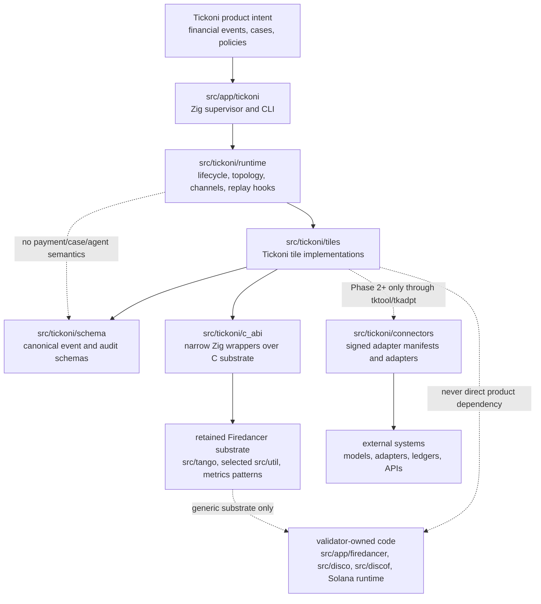
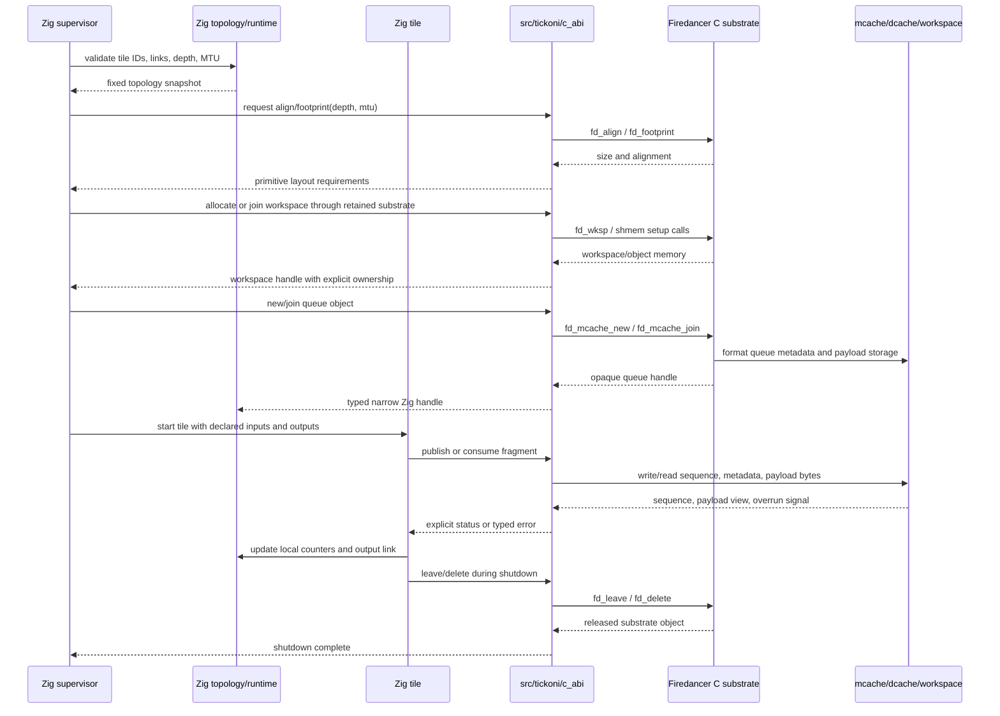

# Tickoni Zig Runtime Philosophy And Style Guide

This document extends [`firedancer.md`](firedancer.md) for the Zig-native
Tickoni runtime. It is not a replacement for the Firedancer philosophy. It is
the rulebook for carrying that philosophy into Tickoni without mixing product
logic into upstream-hot validator code or hiding isolation boundaries behind
comfortable abstractions.

Read "Tickoni" here as:

- `src/app/tickoni`: Zig supervisor, CLI, and process lifecycle entrypoints
- `src/tickoni/runtime`: topology, channels, tile handles, lifecycle, metrics,
  backpressure, and replay/runtime support
- `src/tickoni/c_abi`: narrow Zig declarations and wrappers around retained
  Firedancer C substrate
- `src/tickoni/codec`: Zig/C codec bindings and implementations for canonical
  schema encodings
- `src/tickoni/schema`: Tickoni financial event, policy, audit, case, and
  capability schemas; protobuf sources live under `src/tickoni/schema/proto`
- `src/tickoni/tiles`: Tickoni-owned tile implementations
- `src/tickoni/test/demo`: deterministic CLI and test demo orchestration
- `src/tickoni/connectors`: signed adapter manifests and adapter code, when
  that phase exists

Do not use this guide as permission to edit `src/app/firedancer`,
`src/disco`, `src/discof`, `src/tango`, or `src/util` for Tickoni convenience.
Those paths remain upstream substrate unless a change is genuinely generic and
reviewed as such.

## Source-Tree Guide

Use this table to decide where new code belongs. When a path is ambiguous,
ask rather than guess — misplaced code makes the ownership invariants stated
in CLAUDE.md harder to enforce.

| What you are adding | Where it belongs |
| --- | --- |
| Tile lifecycle, topology descriptors, channel handles, metrics surfaces, replay hooks, process/sandbox config | `src/tickoni/runtime/` |
| Narrow Zig `extern` declarations and small wrappers over retained Firedancer C substrate | `src/tickoni/c_abi/` |
| Canonical cross-tile financial event, policy, audit, case, and capability schemas that must be shared across tile boundaries | `src/tickoni/schema/` |
| Protobuf wire definitions for canonical schemas | `src/tickoni/schema/proto/<domain>/` |
| Binary, JSONL, protobuf, and hash codec implementations for canonical schemas | `src/tickoni/codec/` |
| Tile-owned implementation code: request/response types used only within one tile, tile run loop, backend variants, validators, dispatchers | `src/tickoni/tiles/<tile>/` — use `types.zig` for pure type definitions, `messages.zig` for request/response message types |
| Deterministic demo orchestration code imported by the CLI and multiple tests (for example the investment demo flow) | `src/tickoni/test/demo/<demo>/` |
| Pure test doubles (`MockBackend`), HTTP mock servers, and other test-only helpers not needed in production | `src/tickoni/test/mocks/` |
| Financial fixture data files (JSON, binary) used by demo and integration tests | `src/tickoni/test/fixtures/`; scenario data belongs under a `scenarios/` child directory |

### Naming rules within a tile directory

- `mod.zig` — public surface; re-exports types and functions from sibling files.
- `types.zig` — tile-local type definitions (enums, structs, payload types) that
  do not cross tile boundaries.
- `messages.zig` — tile-local request/response message types (e.g. `TkModlRequest`,
  `AdapterRequest`) passed between the tile and its callers.
- `backend.zig` — backend variants and the `Backend` tagged union.
- `validator.zig` — input validation and scope checking.
- `run.zig` — orchestration of a governed request through validation and backend.
- `codec.zig` — binary and JSONL encoding/decoding for tile-owned formats.
- `fixture_*.zig` — fixture builders used in tests within this tile.

Do not name any tile-local file `schema.zig`. That name is reserved for files
under `src/tickoni/schema/` that define canonical cross-tile contracts.

The Tickoni tile pattern is closer to Firedancer's tile boundary shape than to
MVC or MVVM. Each tile has a public module, explicit local contracts, optional
backend strategy, validation, and run orchestration. Use this skeleton when a
tile has enough behavior to split:

```text
src/tickoni/tiles/<tile>/
  mod.zig          public surface and re-exports
  types.zig        tile-owned pure types
  messages.zig     tile request/response messages
  backend.zig      tagged-union backend strategy
  validator.zig    fail-closed input and scope validation
  run.zig          orchestration through validate -> backend -> response
  codec.zig        tile-owned encodings, only when needed
  fixture_*.zig    tile-local fixture builders, only for tests
```

Small placeholder tiles may temporarily have only `mod.zig`, but once a tile
owns request/response messages, backend variants, validation, or orchestration,
put that code in the named file above instead of growing `mod.zig`.

## Core Rule

Tickoni is a financial event runtime first and an AI harness second.

The implementation order is:

```text
runtime first
cases second
agents third
privileged actions last
```

Do not introduce agents, model calls, adapters, UI state, or privileged action
execution into the deterministic event path. A payment event must be ingestible,
normalized, deduplicated, policy-checked, audited, and replayable without
running a model.

## Preserve The Firedancer Shape

Zig may make code safer and clearer, but it must not make the system less
explicit. The Firedancer inheritance worth keeping is:

- explicit topology over discovery
- fixed capacity over unbounded allocation
- one writer for hot mutable state
- bounded channels over unbounded message queues
- process isolation over in-process trust
- concrete restart, overrun, shutdown, and telemetry behavior
- mechanical simplicity in hot loops

The reader should still be able to answer the Firedancer questions for every
Tickoni change:

1. Which tile owns this state?
2. Which workspace or allocation holds it?
3. Which process maps or owns it, and in what mode?
4. Which fields are written concurrently, and by whom?
5. What is the overrun, restart, and shutdown behavior?
6. Which metrics or logs tell an operator it is unhealthy?

If those answers are vague, do not add the code yet.

## Separation Rules

Keep these boundaries hard.

### Separation Diagram

The runtime separation should look like this:



The dotted lines are warning lines. They should trigger design review, not
become convenience paths.

### Validator Substrate vs Product Runtime

Allowed:

- wrap stable Firedancer substrate behind `src/tickoni/c_abi`
- reuse `src/tango` queue concepts, `src/util/sandbox`, metrics patterns, and
  topology/process-lifecycle ideas
- import upstream fixes into retained substrate deliberately

Not allowed:

- add Tickoni fields to Firedancer topology structs for product convenience
- rename Solana validator tiles into financial tiles
- put financial event schemas in `src/disco`, `src/discof`, or `src/flamenco`
- make the Tickoni product binary depend on Solana protocol tiles
- keep whole-tree merge pressure as an excuse to preserve unused validator code

When in doubt, add a narrow wrapper in `src/tickoni/c_abi` or a Tickoni-owned
module, not a product hook in upstream C.

### Reusing Firedancer Code Well

Reuse more of Firedancer by reusing real substrate paths, not by copying one
convenient header and faking the rest of the environment around it.

Rules:

- keep `src/tickoni/c_abi` narrow: Zig `extern` declarations, layout checks,
  and small wrappers that preserve C ownership semantics
- put Tickoni-owned schema, codec, export, and domain logic in Tickoni-owned
  modules such as `src/tickoni/codec`, not under `src/tickoni/c_abi`
- use `src/tickoni/c_abi/queue.zig` and `src/tickoni/c_abi/sandbox.zig` as
  the expected shape for Firedancer-facing bindings
- do not add business-adjacent C implementation under the ABI folder just
  because Zig calls it through `extern`
- prefer existing Firedancer-native primitives before introducing new third-
  party substrate, but reuse them through explicit ownership boundaries
- if a Firedancer helper path pulls in logging, asserts, SIMD assumptions, or
  runtime symbols, either link the real Firedancer substrate deliberately or
  drop to a more explicit lower-level path
- prefer portable wire/token paths when the convenience inline/helper path
  drags in hidden runtime dependencies that do not belong at the boundary
- do not fake Firedancer log/runtime symbols in product integration code just
  to satisfy linkage; that is a temporary test shim at best, not a healthy
  architectural shape
- treat sanitizer disables, alignment exceptions, and one-off compile defines
  in bridge code as integration smell; they usually mean the chosen reuse path
  is too implicit or owns too much
- keep binary encoding, readable export, replay transforms, and audit-domain
  schema ownership together in the owning Tickoni module, then keep the ABI
  layer mechanical and thin

If the bridge starts needing symbol stubs, build exceptions, or ownership that
cannot be explained in one sentence, stop and move the logic back into a
Tickoni-owned module. The goal is to reuse Firedancer substrate faithfully,
not to hide new product code behind the ABI membrane.

### Firedancer Utility Reuse

Default to Firedancer. When a Firedancer utility covers a need, call it through
a C extern even at FFI cost. Do not write Tickoni-owned helpers that duplicate
what Firedancer already provides.

The reuse boundary is wide. Everything outside Solana validator semantics is
in scope:

- `src/util/bits` — `fd_ulong_load_*` and `fd_uint_load_*` for unaligned
  integer loads, `fd_ulong_bswap` and `fd_uint128_bswap` for byte reversal,
  `fd_ulong_hash` for integer bijections, and all other bit utilities
- `src/util/cstr` — `fd_cstr_ncpy`, `fd_cstr_printf`, `fd_cstr_to_*` for
  string handling and number formatting
- `src/util/math` and `src/util/hist` — fixed-point arithmetic, statistics
- `src/util/io` and `src/util/log` — structured IO and the `fd_log_*` family
- `src/ballet/siphash13` — `fd_siphash13` for streaming hash (current audit
  hash function)
- `src/ballet/sha256`, `src/ballet/sha512`, `src/ballet/keccak` — for
  content-addressed audit evidence and any future crypto needs
- `src/ballet/pb` — `fd_pb_encoder` and `fd_pb_tokenize` for protobuf
  encoding and decoding
- `src/waltz/http` — `fd_http_server` for the `tkapi` tile HTTP/WebSocket
  surface
- `src/tango` — mcache, dcache, and workspace queue substrate

The only exclusion is Solana-specific substrate: consensus, gossip, RPC wire
formats, account/slot/epoch/leader-schedule structs, vote program logic, SVM
execution, and validator-only tile identities. Those carry Solana semantics
that do not belong in Tickoni financial event processing.

When evaluating whether to write a helper:

1. Check `src/util` and `src/ballet` first. If the function exists there, use
   it via C extern, even if the Zig stdlib has an equivalent.
2. If the operation belongs to codec framing, encoding, or parsing, implement
   it in the owning C codec file alongside the format and parse functions that
   share the same frame boundary knowledge. Then call it from Zig as an extern.
3. Write a Tickoni-owned helper only when the need is genuinely Tickoni-
   specific and nothing in Firedancer covers it. Add a comment naming the
   Firedancer function checked and why it does not apply.
4. Do not wrap a Firedancer function in a Zig function that adds no behavior.
   Call the extern directly, or inline the `@bitCast` / `std.mem.readInt` at
   the call site if it truly requires no C at all.

### Zig To C Action Diagram

Zig owns product semantics and tile lifecycle. C owns retained low-level
substrate primitives. The ABI boundary passes primitive configuration, pointers,
footprints, and status. It must not pass Tickoni product structs into Firedancer
substrate.



The important direction is not "Zig above C" or "C below Zig." The important
direction is ownership:

- Zig topology decides which tile may see which object.
- C substrate formats and operates low-level memory objects.
- Product schemas stay in Tickoni-owned Zig modules.
- Opaque C handles stop at the C ABI wrapper or the narrow runtime object that
  owns them.
- Tiles exchange bytes and sequence state through declared links, not through
  hidden global access.

### Runtime vs Product Semantics

`src/tickoni/runtime` owns generic runtime machinery:

- topology descriptors
- tile handles
- lifecycle state
- bounded channel descriptions
- metrics surfaces
- replay/runtime control hooks
- process and sandbox configuration

It must not own payment-specific behavior, case decisions, agent prompts,
adapter manifests, or accounting ledger logic. Those belong in schema, tile, or
connector modules.

### Tiles vs Libraries

A tile is an execution owner. It should have one responsibility and one clear
ownership boundary.

Good tile boundaries:

- `tkings` owns ingestion offsets and ingress backpressure
- `tknorm` owns canonical event normalization
- `tkdedu` owns deduplication state
- `tkpoly` owns policy decisions for its phase
- `tkaudt` owns append-only audit ordering
- `tkrepl` owns deterministic replay comparison
- `tkmetr` owns metrics export
- `tkdiag` owns process and queue diagnostics

Bad boundaries:

- one "processor" tile that ingests, normalizes, dedupes, and audits
- a shared mutable case table updated by several tiles
- a helper library that secretly launches model calls from the event path
- a global registry that lets tiles discover arbitrary channels or objects

Libraries can parse, hash, encode, and validate. Tiles own mutable runtime
state and external authority.

### Agents, Tools, And Privileged Actions

Agents are not the security boundary. Policy, tile isolation, capability
envelopes, and audit are the boundary.

Rules:

- agent workers do not get shell access
- agent workers do not get unrestricted network access
- model-provider network access belongs behind `tkmodl`
- tool access belongs behind `tktool`
- external integrations belong behind signed `tkadpt` instances
- money-adjacent mutation belongs behind `tkexec`
- replay never invokes production mutation

Do not add a convenience path around these boundaries, even for demos. Demos
must prove the boundary, not bypass it.

## Topology Before Code

Before implementing a non-trivial tile or link, update the architecture or tile
plan with:

- runtime ID and human-readable name
- phase
- owned state
- input links
- output links
- queue depth and MTU
- reliable or unreliable behavior
- backing workspace or allocation
- producer and consumer mapping/ownership mode
- restart behavior
- overrun behavior
- shutdown behavior
- metrics

Example:

```text
link: tkdedu_tkpoly
producer: tkdedu
consumer: tkpoly
payload: deduplicated event decision input
depth: 1024
mtu: fixed event envelope size
reliability: reliable
owner writes: tkdedu writes payload and publish sequence
consumer writes: tkpoly writes only local counters and output link
overrun: producer applies backpressure before dropping correctness-bearing input
restart: consumer resumes from audited source offset or replay capsule
metrics: produced, consumed, lag, backpressure_ns, malformed, dropped
```

If the topology cannot be written plainly, the implementation is probably
mixing responsibilities.

## Firedancer Configuration And The AI Harness

Changes to Firedancer configuration, layout, topology, sandboxing, or
diagnostics affect the Zig harness even when no Tickoni product code changes.
The harness is allowed to wrap Firedancer-derived substrate, but it must not
turn Firedancer's explicit contracts into implicit Zig convenience.

Treat these Firedancer concepts as harness-facing contracts:

- `src/app/firedancer/config/default.toml` documents operator defaults and
  option names.
- `config_t` records parsed and derived values.
- `src/app/firedancer/topology.c` turns configuration into concrete tiles,
  links, workspaces, objects, affinity, memory, and feature gating.
- Tile launch code turns topology into process mappings, sandbox permissions,
  metrics registration, and run-loop entry.

The Tickoni equivalent should preserve the same shape:

- `src/app/tickoni` owns CLI/config loading and supervisor startup.
- `src/tickoni/runtime/topology.zig` owns the immutable topology snapshot.
- `src/app/tickoni/supervisor.zig` owns tile lifecycle and start/stop order.
- `src/tickoni/c_abi` owns narrow wrappers around retained C primitives.
- Tickoni product schemas and agent/case logic stay outside the runtime
  substrate.

When a Firedancer-derived option crosses into Tickoni, map it deliberately:

1. The external name and default are documented in Tickoni-owned config docs or
   profile files.
2. The parsed Zig config type has a bounded field with explicit units.
3. Validation rejects unsupported values before the supervisor starts.
4. The topology snapshot records the resulting tile count, channel depth, MTU,
   workspace/allocation requirement, and feature gate.
5. The supervisor allocates all required handles and backing memory before the
   steady-state path.
6. The C ABI wrapper receives only primitive layout inputs such as depth, MTU,
   alignment, footprint, uid/gid, rlimit, or file descriptor lists.
7. Sandbox, network, filesystem, and model/tool permissions are visible as
   explicit runtime fields, not hidden side effects of an option.
8. Metrics, diagnostics, audit, or startup logs expose the effective behavior.

Do not make Zig "simpler" by collapsing those steps into one builder that
discovers everything at runtime.  A contributor should be able to inspect the
topology snapshot and know what will exist, how large it is, who owns it, and
which process can access it.

### Layout Translation

Firedancer layout is not just CPU placement.  It changes how many isolated
execution owners exist and how links are wired between them.  The Tickoni
harness should treat its own tile counts the same way.

If a Tickoni config adds `tkdedu_tile_count`, for example, the topology must
answer whether events are partitioned by key, round-robin load balanced,
replicated to every dedup tile, or merged by a downstream owner.  The answer
belongs in `Topology`, not in an ad hoc loop inside `Supervisor.start`.

For every configurable tile count, validate:

- enough tile IDs and human-readable names exist,
- every instance gets a stable index and diagnostic identity,
- channel producers and consumers remain one-writer where required,
- channel depths and MTUs are sized for the configured fan-in/fan-out,
- allocation is bounded before the hot path,
- disabled phases remove all dependent channels and permissions,
- monitor and metrics output can distinguish each instance.

### C ABI Drift

If Firedancer changes an `align`, `footprint`, `new`, `join`, `leave`,
`delete`, seccomp, or topology primitive, the Zig wrapper must be reviewed as
part of the same conceptual change.  Do not rely on a stale constant in Zig
when the C header is the authority.

Keep wrapper tests focused on boundary invariants:

- `extern struct` size, alignment, and field offsets,
- constant values copied from C headers,
- error translation for invalid depth, MTU, or footprint,
- lifecycle order around `new/join/leave/delete`,
- restrictive defaults for sandbox config,
- explicit failure when a C primitive returns null or zero footprint.

The C ABI should not accept Tickoni event, case, policy, audit, prompt, or tool
types.  It should accept the primitive substrate facts needed to create or use
memory, queues, sandboxing, and process lifecycle.

### Diagnostics Translation

The operator-visible consequences of configuration must survive the Zig layer.
If a config changes channel depth, tile count, sandbox permissions, replay cap,
model budget, adapter capability, or audit retention, the harness needs an
observable effective value.

Use the right surface:

- startup logs for effective topology, capacities, disabled phases, and
  sandbox facts,
- metrics for lag, drops, overruns, backpressure, crashes, and restart count,
- audit records for material financial decisions, denials, external results,
  and replay-relevant facts,
- monitor/API state for tile lifecycle and queue health.

Do not report a configured value when the effective value is different.  Report
what the supervisor actually built.

## Zig Style For Runtime Code

Use idiomatic Zig where it improves explicitness. Do not build a high-level
framework that hides the same details Firedancer makes visible.

Prefer:

- plain structs with explicit fields
- small error sets on boundary APIs
- comptime constants for fixed capacities and layout constraints
- explicit allocator ownership
- slices that make lifetimes obvious
- `extern struct` only for C ABI layout
- tests for layout, limits, and topology validation

Avoid:

- global mutable registries
- dynamic plugin discovery in the runtime path
- unbounded `ArrayList` growth in hot paths
- hidden allocation inside parse, hash, or enqueue helpers
- background threads spawned from utility functions
- generic "event bus" abstractions
- catch-all `anyopaque` handles outside narrow C ABI edges
- convenience APIs that let a tile access state it does not own

Zig safety features are welcome, but they are not a substitute for topology
discipline. A bounds check does not define ownership. An allocator does not
define capacity. A type does not define process isolation.

### No-Nos

- No polyfills or compatibility shims that hide unsupported runtime targets.
- No exotic dynamic instantiation based on runtime shape checks such as generic
  `anyopaque` probing, tagless unions, or stringly-typed object dispatch.
- No service-locator-style hidden resolution for tiles, storage handles,
  model providers, adapters, policies, or capability catalogs.
- No architecture-by-accident. If a helper starts owning state, external
  authority, or lifecycle, it probably wants to be a tile or an explicit
  module.
- No lint, formatter, sanitizer, seccomp, or test bypasses as a substitute for
  refactoring.
- No direct agent-to-model, agent-to-financial-API, agent-to-TigerBeetle, or
  UI-to-TigerBeetle paths.
- No hidden mutable global registries for capabilities, adapters, model
  providers, tile links, or storage backends.

### Storage Access Boundaries

- Markdown files are for memory, theses, policies, company notes, runbooks, and
  human-authored operating context. They are read as context and must not be
  treated as deterministic runtime truth unless versioned and captured into
  audit or replay inputs.
- DuckDB is for market data, analytics, backtests, research tables, and local
  analytical projections. Do not use DuckDB as authoritative balances,
  transfers, fills, or accounting state.
- TigerBeetle is for balances, transfers, fills, accounting entries, and
  approved ledger-style financial state. Access belongs behind `tkexec` or a
  narrow executor-owned finance database module.
- Runtime code, agents, UI/API handlers, model gateway code, and adapter code
  should use explicit storage module APIs or tile messages. Do not scatter file
  IO, SQL, DuckDB queries, or TigerBeetle calls across unrelated code.
- If a needed operation is not exposed by the proper storage boundary, add or
  extend that boundary instead of bypassing it.
- Storage writes that affect policy, audit, replay, balances, transfers, fills,
  or accounting must be tied to capability decisions and audit records.

### HTTP Constants

- Do not hardcode HTTP status codes, method strings, WebSocket paths, or
  content-type strings throughout runtime or test code.
- Prefer shared local constants or small typed enums for repeated HTTP methods,
  status codes, route paths, content types, and WebSocket message types.
- When wrapping Firedancer `fd_http_server`, use its method constants such as
  `FD_HTTP_SERVER_METHOD_GET` and `FD_HTTP_SERVER_METHOD_POST` at the C ABI
  edge, and expose a narrow Zig representation above that edge.
- Keep route definitions for `tkapi` centralized. Tests should import route
  constants or helpers instead of duplicating endpoint strings.
- Apply this rule consistently in runtime code, integration tests, and
  CaseOps/daemon test harnesses.

### Casting And Type Safety

- Avoid unsafe casts, especially pointer casts across tile, storage, or C ABI
  boundaries.
- Keep `anyopaque`, raw pointers, and `extern` layout details inside
  `src/tickoni/c_abi` or the narrow runtime object that owns them.
- Do not create candidate objects with unknown field types and then branch on
  runtime type shape. If this seems necessary, fix the schema, tag, enum, or
  boundary contract instead.
- Prefer tagged unions, enums, explicit structs, and canonical decoders for
  capability envelopes, audit records, adapter requests, and replay records.
- If an unsafe cast is truly unavoidable, keep it local, document why the
  layout is valid, add a test where possible, and flag it in the handoff.
- Do not suppress compiler, sanitizer, lint, or static-analysis findings unless
  explicitly approved.

### Error Handling

- Let errors bubble up through lower layers.
- Catch errors only at the highest level that can add meaningful context or
  convert them into the correct boundary behavior.
- When catching, log with useful identifiers such as tile id, link name,
  source offset, case id, capability id, policy version, request id, adapter id,
  or replay capsule id, then rethrow unless the boundary intentionally
  terminates or translates the error.
- Do not swallow errors, downgrade policy denials into warnings, or continue
  with partial topology, partial audit state, or unknown replay state.
- Malformed input should become explicit rejection, metric, and audit behavior;
  internal invariant failures should remain loud.

### Dependency Injection

Tickoni uses tagged unions as the primary DI mechanism. A tagged union names the
available implementations as enum tags and stores each implementation's
configuration as a struct field. This keeps dispatch explicit, avoids hidden
global state, and makes the swap point readable at the call site.

#### Tagged union backend pattern

Define a tagged union for any tile boundary that needs to be swappable between a
stub or mock and a real external call:

```zig
// Naming: <Noun>Backend for the union, <Noun>Backend.<variant> for each impl.
pub const Backend = union(enum) {
    mock: MockBackend,      // stub used in unit tests
    http: HttpBackend,      // real HTTP call used in integration tests and prod

    pub fn call(self: *Backend, allocator: std.mem.Allocator, req: Request) anyerror!Response {
        return switch (self.*) {
            .mock => |m| m.call(allocator, req),
            .http => |h| h.call(allocator, req),
        };
    }
};
```

Rules:

- The dispatch function signature must be identical across all variants.
  Callers see one surface.
- Use `anyerror!T` for the return type when variants have disjoint error sets.
  Avoid creating a union error set just to satisfy the type checker.
- Keep the dispatch function in `Backend`, not spread across call sites.

#### Storing external context in the impl struct

Each implementation struct carries the context it needs to do its job. The
struct is the DI container.

```zig
pub const HttpBackend = struct {
    endpoint: []const u8,   // where to call
    io: std.Io,             // how to open TCP connections

    pub fn call(self: HttpBackend, allocator: std.mem.Allocator, req: Request) !Response {
        var client = std.http.Client{ .allocator = allocator, .io = self.io };
        ...
    }
};
```

Rules:

- All context needed by an implementation must be stored in its struct, not
  read from globals or thread-locals inside `call`.
- Pass `std.Io` explicitly as a struct field. In tests, callers pass
  `std.testing.io`. In the supervisor, callers pass the tile's io from the
  Firedancer-style runtime context. Neither the struct nor the function guesses.
- Pass `std.mem.Allocator` as a function argument, not as a struct field, so
  call-scoped allocations are bounded to the call's lifetime. Store an
  allocator as a struct field only when the struct manages long-lived memory
  (e.g., a connection pool) and the caller transfers ownership explicitly.
- Keep `MockBackend` minimal: a set of pre-loaded canned responses and no side
  effects. If a test needs to vary responses, add a field, not a global counter.

#### Test layer consequences

| Test layer | Backend variant | `std.Io` source |
| --- | --- | --- |
| unit test (`zig build test`) | `.mock` | not needed |
| integration test (`zig build integration-test`) | `.http` | `std.testing.io` |
| supervisor (future production) | `.http` (or real variant) | tile runtime io |

Unit tests should never construct a real backend. Integration tests should never
construct a mock backend except to verify skip behavior when the real service is
absent. If an integration test finds the real server unreachable, it returns
`error.SkipZigTest`; it does not silently fall back to the mock.

#### What to avoid

- **Service locator**: do not resolve the backend from a global registry keyed
  by string or type. The caller passes the backend; the callee does not discover
  it.
- **Vtable-heavy interface structs**: a struct with function-pointer fields is
  harder to read and adds indirection without benefit when a tagged union covers
  the same ground with less boilerplate.
- **Runtime `anytype` dispatch**: an `anytype` parameter that secretly branches
  on type at comptime hides the backend contract from reviewers and tests.
- **Implicit fallback inside `call`**: if the real service is absent, return an
  error. Do not silently switch to the mock path. Implicit fallback means
  integration tests can pass without ever reaching the real service.
- **Comptime-only switch**: comptime backend selection via a build flag or
  comptime parameter is appropriate only when the two implementations cannot
  coexist in the same binary. The tagged union is preferred because it keeps
  both paths tested in the same test binary.

#### Example: swapping from unit test to integration test

Unit test (no real service required):

```zig
var backend = Backend{ .mock = .{ .canned_content = "test output" } };
const resp = try backend.call(allocator, req);
defer resp.deinit(allocator);
try std.testing.expectEqualStrings("test output", resp.content);
```

Integration test (real service, skip if absent):

```zig
var backend = Backend{ .http = .{ .endpoint = endpoint, .io = std.testing.io } };
const resp = backend.call(allocator, req) catch |err| switch (err) {
    error.ServerUnreachable => return error.SkipZigTest,
    else => return err,
};
defer resp.deinit(allocator);
try std.testing.expect(resp.content.len > 0);
```

The swap is a single struct literal at construction. Nothing else changes.

## Memory And Allocation

Runtime allocations must be bounded by topology or startup configuration.

Good:

- allocate tile handles once during supervisor initialization
- compute queue footprints from depth and MTU
- allocate replay buffers from a configured cap
- reject a config that exceeds fixed limits

Bad:

- allocate per event in the steady-state path
- grow queues because a consumer fell behind
- store whole model transcripts in hot runtime memory
- hide payload copies inside generic helpers

The Phase 0 synthetic pipeline may use ordinary in-process state to prove
lifecycle, but production paths should move toward explicit queue objects,
workspace-backed state, and process isolation.

## Concurrency

Use one writer per hot object. If a design wants multiple writers, the default
answer is to split the object or add a single owner tile.

Allowed patterns:

- producer writes an output channel and publishes sequence
- consumer reads input and writes only its own counters, fseq/progress, and
  output channel
- supervisor owns tile lifecycle state
- audit tile owns audit ordering

Suspicious patterns:

- two tiles mutate the same map
- a helper updates both policy and audit state
- a model callback writes directly into case state
- an adapter writes into the audit chain

Use atomics only for clearly documented lifecycle flags, counters, or ring
protocol fields. An atomic does not make an ownership model correct by itself.

## Error Handling And Assertions

Use assertions for internal invariants that indicate programmer error. Use
explicit errors for operator-facing validation and malformed input.

Good:

- assert that a synthetic test supervisor is using the expected payment pipeline shape
- return `error.ChannelDepthNotPowerOfTwo` from topology validation
- reject malformed financial events with a counted policy/audit record
- fail startup when configured capacity cannot be allocated

Bad:

- assert on user-provided event data in a long-running tile
- silently drop malformed events without metrics
- catch an error and continue with partial topology
- convert all failures to `error.Unknown`

Every failure mode in the event path should answer whether it is:

- configuration error
- malformed input
- backpressure
- overrun
- sandbox/process crash
- replay divergence
- policy denial

## C ABI Rules

`src/tickoni/c_abi` is a narrow membrane, not a second runtime.

Rules:

- keep declarations close to the C header they mirror
- test layout and alignment for every `extern struct`
- expose small Zig wrappers only when they preserve C ownership semantics
- do not invent new lifetime rules for C-owned memory
- do not pass Tickoni product structs through C substrate APIs
- do not let `anyopaque` escape into product tile code unless there is no
  narrower representation

If a C primitive has `align`, `footprint`, `new`, `join`, `leave`, and
`delete`, mirror that lifecycle in Zig. Do not wrap it as a garbage-collected
object or an unbounded container.

## Schema Rules

Schemas are part of replay. Treat them as compatibility surfaces.

Financial event and audit schemas must:

- have explicit versions
- define which fields affect stable hashes
- separate source facts from runtime facts
- define canonical encoding
- reject unknown required fields
- preserve enough source identity to replay and diagnose

Do not let UI labels, model prompts, or adapter-specific JSON become the
canonical schema. Normalize at the boundary and audit the transformation.

## Audit And Replay Rules

Audit is not logging. Replay is not a best-effort rerun.

Rules:

- every material event gets an audit record
- denials and malformed inputs are recorded
- audit records are append-only and hash-chained
- large payloads are content-addressed
- replay compares deterministic outputs and reports first divergence
- replay substitutes external results and never performs privileged mutation

Do not add features that cannot explain how they appear in audit and replay.

## Logging, Tracing, Metrics, And Diagnostics

Telemetry is part of runtime correctness and operability, not a post-hoc
feature. A change that affects service health, throughput, latency, progress,
bounded failure classes, policy outcomes, audit append, replay comparison, or
external boundary behavior should usually have a corresponding metric,
diagnostic field, audit record, or log.

Use the observability surfaces already in this repository:

- Tickoni runtime snapshots in `PaymentPipelineState`, `tkmetr`, and `tkdiag`
  for Phase 0.
- Firedancer-style per-tile metrics, generated definitions, and shared metrics
  memory under `src/disco/metrics` when moving toward production `tkmetr`.
- Firedancer logging conventions and severity behavior at C substrate edges.
- Startup and supervisor output in `src/app/tickoni` for effective topology and
  lifecycle facts.
- Audit records for material financial events, policy decisions, denials,
  model/tool/adapter results, approvals, and replay-relevant facts.

Do not invent a second telemetry stack, background exporter, tracing bootstrap,
or metrics registry for convenience. If a new exporter or scrape endpoint is
needed, route it through the Tickoni-owned telemetry plan and the `tkmetr` or
`tkdiag` ownership model.

### Logging

Add logs on important execution paths where an operator needs a narrative fact
that is not already obvious from counters:

- major lifecycle decisions, startup, shutdown, restart, and crash-only exits,
- effective topology, capacities, disabled phases, sandbox facts, and runtime
  feature gates,
- state transitions with external meaning,
- idempotent skips and duplicate suppression,
- reconciliation decisions,
- audit append failures, replay divergence, and policy-boundary failures,
- C ABI translation failures and substrate lifecycle errors.

Include concrete identifiers where they help diagnose without creating log
spam:

- tile id and tile index,
- link name, depth, MTU, producer, and consumer,
- source offset, event id, case id, request id, replay capsule id,
- capability id, policy version, decision, outcome, and budget id,
- audit sequence and audit hash,
- adapter id, table name, account, destination, venue, instrument, address, or
  block/ledger identifier where relevant.

Avoid vague logs such as "failed", "skipped", "bad state", or "invalid input"
without the boundary and stable identifiers needed to act on them. Frequent
steady-state events, backpressure, denials, duplicate skips, and malformed
input classes should be counted and audited where appropriate; do not write one
log line per hot-path fragment or per expected reject.

When catching or translating errors, log useful boundary context and preserve
the original error cause unless the boundary intentionally terminates,
classifies, or translates it. Do not swallow errors, downgrade policy denials
into generic warnings, or continue after unknown audit, topology, sandbox, or
replay state.

At Firedancer C edges, follow Firedancer logging expectations: use errors for
operator-facing invalid configuration or unrecoverable substrate failures,
warnings for unexpected but survivable conditions, and counters for frequent
events. Do not call logger APIs from signal handlers or high-rate packet/event
paths.

### Tracing

Tickoni does not currently ship a standalone OpenTelemetry bootstrap or local
Tempo/Grafana stack. The current Phase 0 surface is in-memory metrics,
diagnostics, and supervisor output. Future tracing should extend the owning
tile, supervisor, `tkapi`, `tkmodl`, `tktool`, `tkadpt`, or `tkexec` boundary
that already knows the operation outcome.

Do not create a second tracing bootstrap path inside helper code. If tracing is
introduced, it must be a Tickoni-owned runtime feature with explicit startup
configuration, failure behavior, and tests. It must not be a hidden dependency
of agents, adapters, model providers, or UI handlers.

Keep operation names and span names stable and low-cardinality. Good names
describe orchestration boundaries:

- `tickoni-supervisor-start`
- `tkings-ingest`
- `tknorm-normalize`
- `tkdedu-dedupe`
- `tkpoly-evaluate`
- `tkaudt-append`
- `tkrepl-compare`
- future `tkapi-request`, `tkmodl-request`, `tktool-call`, `tkadpt-request`,
  and `tkexec-action`

Do not put tx hashes, event IDs, account IDs, addresses, audit hashes, header
hashes, table names, request IDs, case IDs, or raw error strings in span names.
Put them in logs, audit records, evidence references, or bounded span
attributes where the tracing implementation supports attributes safely.

### Telemetry Metrics

Every tile should expose enough state to determine whether it is healthy.

Minimum useful counters and gauges:

- input fragments/events received,
- output fragments/events produced,
- malformed inputs,
- duplicate or idempotent skips,
- drops,
- queue lag,
- backpressure time or waits,
- overruns,
- restart count,
- crash count,
- audit records produced, where relevant,
- policy decisions by bounded outcome, where relevant,
- replay divergences, where relevant.

Keep metrics registration explicit and near the orchestration boundary that
owns the outcome. Good instrumentation points are:

- supervisor startup, shutdown, restart, and crash handling,
- tile input consumption and output production,
- queue publish/consume overrun and backpressure handling,
- event normalization and rejection,
- dedupe decision,
- policy decision,
- audit append,
- replay comparison,
- future HTTP/WebSocket handlers where request outcomes are known,
- future model, tool, adapter, and execution boundary calls.

Do not instrument every helper method just to increase metric volume. Prefer
the highest layer where the outcome is known and labels can remain bounded.

Metric style rules:

- Metric names must be stable and snake_case.
- Counters should use names that read as monotonic event counts. Use `_total`
  when exporting through Prometheus-style surfaces.
- Duration histograms should end in `_seconds` when exported.
- Match metric type to meaning: counter for monotonic counts, gauge for current
  state, histogram for latency or size distributions.
- Prefer clear tile or domain names. Current Phase 0 examples include
  `produced`, `normalized`, `invalid`, `duplicates`, `allowed`, `denied`,
  `audited`, `backpressure_waits`, `max_queue_depth`, and
  `max_latency_hops`.
- Metrics that represent durable state must update only after the relevant
  audit append, database update, ledger mutation, or external submission path
  succeeds.
- Metrics must not imply a bounded in-memory queue is durable. Durability
  begins only when the owning durable store or append-only audit path accepts
  the data.

Keep labels low-cardinality and bounded. Allowed future label shapes include:

- `tile`
- `link`
- `stage`
- `outcome`
- `decision`
- `failure_kind`
- `capability`
- `environment`
- `method`
- `route`
- `status_code`

Never put high-cardinality values in metric labels:

- source event IDs,
- payment IDs,
- tx hashes,
- block/header/audit hashes,
- account IDs,
- case IDs,
- request IDs,
- wallet, bank, processor, or trading addresses,
- UUIDs,
- raw exception messages,
- stack traces,
- arbitrary request paths,
- prompt text,
- raw model output.

Put high-cardinality identifiers in audit records, logs, evidence stores, or
trace attributes instead.

### Diagnostics

Diagnostics are the low-rate facts needed to operate the topology. They should
answer what the supervisor actually built, which tile owns a failure, and
whether the runtime is safe to keep running.

Expose stable diagnostics for:

- tile lifecycle state,
- crashed tile identity,
- sandbox failures,
- queue saturation and overrun state,
- final audit sequence and audit count,
- replay checked/matched state,
- effective topology values,
- disabled phases and feature gates,
- future model/tool/adapter/execution boundary health.

Steady-state loss, backpressure, and denials should be metrics and audit data,
not log spam. Crash, corruption, unknown replay state, and impossible substrate
conditions should be loud and tied to the owning tile or boundary.

### Testing Telemetry

Add tests for telemetry when behavior changes, not just to pad coverage:

- unit tests for metric state transitions and bounded label mapping,
- topology or supervisor tests for effective diagnostics,
- replay/audit tests when new counters depend on audit or replay outcomes,
- integration tests for future scrape endpoints or API telemetry exposure,
  without brittle assertions on exposition ordering.

Cover both happy paths and important edge cases:

- success and error outcomes,
- duplicate/idempotent close paths,
- bounded error classification,
- invalid or missing inputs normalized to stable outcomes,
- crash-only teardown and replay divergence.

When adding, renaming, or removing important runtime metrics, diagnostic fields,
telemetry environment variables, or scrape endpoints, update
`doc/telemetry.md`, `doc/observability.md`, or the relevant runtime README in
the same change.

## Build And Tooling

All Tickoni developer tooling belongs in `justfile` or Tickoni-specific scripts
called by `justfile`. Do not add Tickoni development targets to upstream
Firedancer makefiles.

Use existing recipe naming conventions:

```text
category-scope-verb-component
```

where component is `tk` for Tickoni Zig code, `fd` for Firedancer C code, and
`all` for composition.

Examples:

- `build-tk`
- `test-unit-tk`
- `quality-format-check-tk`
- `security-sanitize-check-tk`

If a tool does not apply to Tickoni yet, the `-tk` recipe may be a no-op in the
justfile. Do not put skip stubs or fake success logic in implementation scripts.

## Testing

The testing guide for this repository is
[`doc/testing-tickoni.md`](../testing-tickoni.md). Treat that document and the
root `justfile` as the source of truth for current test layers and commands.

Run the narrowest relevant test first, then broaden based on risk:

- Tickoni Zig supervisor, topology, queue, sandbox, C ABI wrapper, or Phase 0
  tile behavior: `just test-unit-tk`.
- Firedancer-derived C substrate, Tango, Disco, Discof, Waltz HTTP, utility, or
  C build integration behavior: `just test-unit-fd`.
- Cross-boundary Tickoni/Firedancer changes: `just test-unit-all`.
- Runtime topology, workspace setup, local process startup, or Firedancer dev
  path behavior: `just test-e2e-fd`.
- Broad local validation before risky handoff: `just test-all` or
  `just tests-all`.

Use test layers deliberately:

- Unit tests should isolate the direct function, module, tile helper, queue
  wrapper, or supervisor behavior under test.
- Integration tests should keep Tickoni internals real and substitute only the
  outside tool or harness boundary.
- E2E/system tests should run the real local runtime toolchain and avoid
  internal mocks.

When changing runtime behavior, add or update tests for the behavior being
claimed. Important paths include malformed input rejection, bounded queue
behavior, duplicate/idempotent skips, policy allow/deny decisions, audit hash
chaining, replay comparison, sandbox/crash diagnostics, metrics, and
configuration validation.

Do not remove, rename, or repurpose placeholder recipes such as
`just test-integration-tk` or `just test-e2e-tk` unless the user explicitly
asks for that migration. They keep the command shape stable while Tickoni grows
real integration and e2e layers.

If you do not run a relevant check, say that explicitly in the handoff and
explain why.

## Phase Discipline

Do not pull later-phase concepts into earlier-phase runtime code.

Phase 0:

- synthetic payment stream
- `tkings -> tknorm -> tkdedu -> tkpoly -> tkaudt`
- `tkrepl`, `tkmetr`, `tkdiag`
- stable event hashes
- append-only audit
- replay comparison
- bounded flow and visible backpressure

Phase 1:

- real fintech-like ingestion API
- `tkcase`
- `tkevid`
- case history
- replay capsule format

Phase 2:

- `tkdisp`
- `tkagnt`
- `tkmodl`
- `tktool`
- `tkadpt`
- model and tool audit
- inference budgets

Phase 3:

- `tkapi`
- CaseOps board and approval workflow

Phase 4:

- `tkexec`
- privileged accounting ledger actions
- TigerBeetle or other finance database integrations

If a demo needs a later-phase behavior early, implement a narrow stub that
preserves the boundary and emits audit records. Do not collapse phases into one
tile.

## Review Checklist

Before merging Tickoni runtime work, check:

1. Does this preserve the product/runtime/substrate boundary?
2. Does each mutable object have one owner?
3. Are channel depths and payload bounds explicit?
4. Is allocation bounded outside the hot path?
5. Are process, sandbox, and network permissions explicit?
6. If this mirrors or wraps a Firedancer config/topology/C ABI change, did the
   Zig config, topology snapshot, supervisor allocation, wrapper tests, and
   diagnostics move with it?
7. Are malformed input, overrun, restart, and shutdown behavior defined?
8. Are metrics sufficient to diagnose lag, drops, and crashes?
9. Are material events, denials, and external results auditable?
10. Can replay reproduce or compare the behavior without external mutation?
11. Did the change avoid adding Tickoni product logic to upstream Firedancer
    paths?
12. Does new utility code check `src/util` and `src/ballet` first? If a
    Firedancer function covers the need, is it called as a C extern rather than
    reimplemented in Zig?

If the answer to any of these is "not yet", finish the design before adding
more code.

## Product Language

Use consumer-money language in product-facing docs, APIs, and demos:

- thesis
- basket
- trade ticket
- buying power
- cash available
- recipient
- beneficiary
- IBAN
- wallet
- rail
- currency
- stablecoin
- spot pair
- quote freshness
- estimated fee
- price impact
- pending obligation
- trusted destination
- blocked reason
- approval-required
- max affordable amount
- max transferable amount
- money-decision proof

Keep internal runtime language inside implementation details:

- `tkmodl`
- `tktool`
- `tkadpt`
- `tkexec`
- capability envelope
- audit record
- replay capsule
- adapter manifest
- signed action envelope
